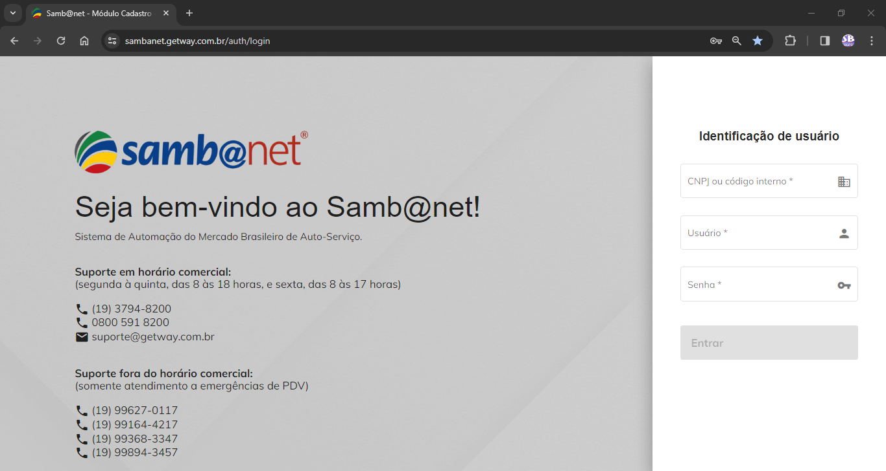
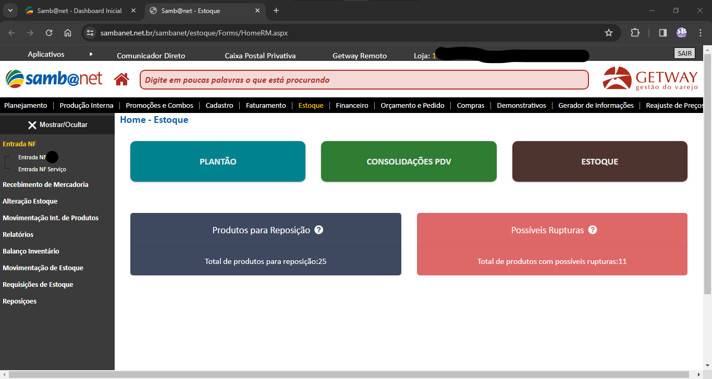
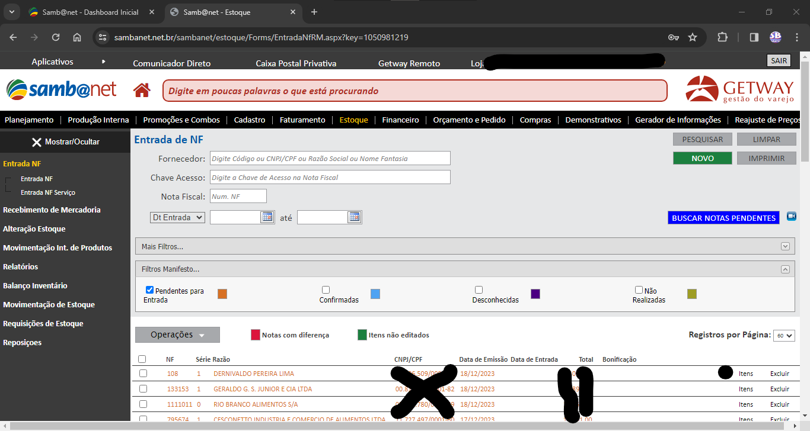
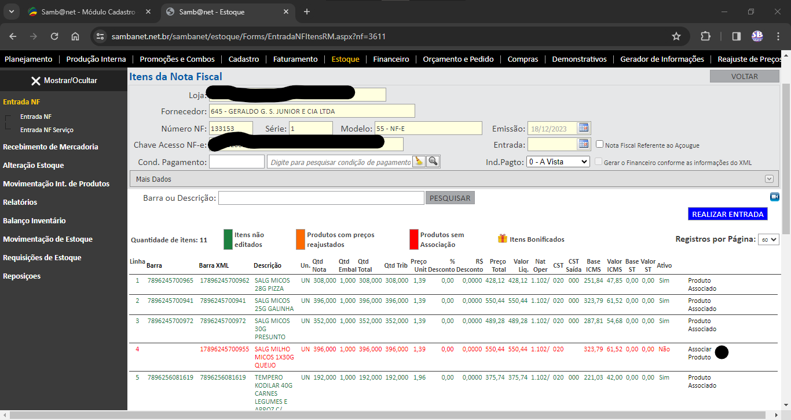

# Samb@net

Script desenvolvido para automatizar a associação de produtos durante o lançamento de Notas Fiscais utilizando o software [Samb@net](https://getway.com.br/universo-sambanet/)

## Descrição dos Eventos

1. Login



2. Navegar para Estoque


3. Navegar para Entrada NF



4. Buscar Notas Pendentes, Selecionar 60 Registros por Página e Navegar para Itens da NF



5. Selecionar 60 Registros por Página e Associar Produtos 



6. Colar o Código de Barras no Campo **Barra** da Seção **Produto no Samb@net**, Aguardar o Carregamento e Salvar


No caso acima, também foi calculado o código de barras da unidade do produto (7896245700958), a partir do código de barras da embalagem (17896245700955). Essa explicação pode ser conferida no link: https://diasjoaovitor.github.io/utils/

Esse processo é repetido até o final das notas pendentes e produtos não associados, limitados a 60 itens. Até então, a navegação entre páginas não foi concluída nesse script

Ao final, é gerado um relatório em formato `JSON`, mostrando todos os produtos associados e não-associados, incluindo suas respectivas notas fiscais  

## Como Executar

Instalação das dependências externas

```
sudo apt-get install python3-pip
pip install playwright
python3 -m playwright install
python3 -m playwright install-deps
```

Instalação das dependências internas

```
cd sambanet-associate
yarn
```

Execução

```
yarn start
```


