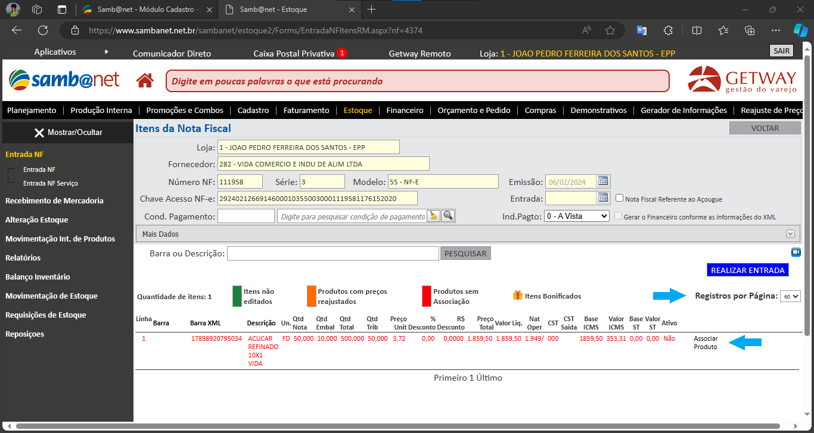
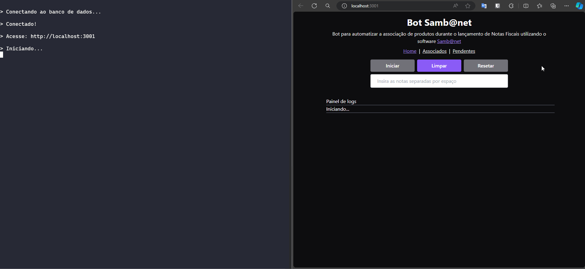

# Samb@net

Script desenvolvido para automatizar a associação de produtos durante o lançamento de Notas Fiscais utilizando o software [Samb@net](https://getway.com.br/universo-sambanet/)

## Tecnologias

- [Express](https://expressjs.com/pt-br/)
- [MongoDB Atlas](https://www.mongodb.com/pt-br/cloud/atlas)
- [Pug](https://pugjs.org/api/getting-started.html)
- [Puppeteer](https://pptr.dev/)
- [Socket.io](https://socket.io/)
- [Tailwindcss](https://tailwindcss.com/)
- [Wiston](https://github.com/winstonjs/winston)

## Descrição dos Eventos

1. Realizar Login


2. Navegar para Estoque


3. Navegar para Entrada NF


4. Buscar Notas Pendentes, Selecionar 60 Registros por Página e Navegar para Itens da NF


O script irá navegar para a próxima página até concluir a busca de todas as notas pendentes, após esse processo que será feita a navegação para `Itens da NF`


5. Selecionar 60 Registros por Página e Associar Produtos



6. Colar o Código de Barras no Campo **Barra** da Seção **Produto no Samb@net**, Aguardar o Carregamento e Salvar


No caso acima, também foi calculado o código de barras da unidade do produto (7898920795037), a partir do código de barras da embalagem (17898920795034). Essa explicação pode ser conferida no link: https://diasjoaovitor.github.io/utils/

Da mesma forma que ocorre em `Entrada NF`, o script irá navegar para próxima página até finalizar todos os produto da nota

## Como Executar

### Instalação das dependências externas

```
sudo apt-get install python3-pip
pip install playwright
python3 -m playwright install
python3 -m playwright install-deps
```

### Instalação das dependências internas

```
cd bot-sambanet
npm i
```

### Configuração das variáveis de ambiente

Renomeie o arquivo `.env.example` para `.env` e atribua os valores:

```
URL=
CNPJ=
USER=
PASSWORD=
MONGO_URI=
```

### Execução

```
npm run dev

Acesse: http://localhost:3001
```


Ao iniciar pela primeira vez, o script irá percorrer todas as notas pendentes, e irá salvar as notas que estão com todos os produtos associados no arquivo `nfs-finalizadas.txt`

```
4642-11751
4641-4704
4640-35
4639-36
```

Sempre que o usuário clicar em `Iniciar`, o script irá ignorar todas as notas que estão salvas no arquivo citado, evitando verificar notas que já estão finalizadas novamente.

Caso deseje percorrer todas as notas, basta clicar em `Resetar`



Todos os produtos associados são salvos no banco de dados, e podem ser consultados na tela mostrada abaixo:


Já os produtos não cadastrados são salvos em um arquivo `txt`, que é sobrescrito a cada execução. A tela abaixo mostra todos os produtos não cadastrados ao final de uma varredura completa:


## Logs

Todos os logs ficam salvos no arquivo `app.log`:

```log
{
  message: 'Conectando ao banco de dados...',
  level: 'info',
  timestamp: '2024-03-26T19:06:30.751Z'
}
{
  message: 'Conectado!',
  level: 'info',
  timestamp: '2024-03-26T19:06:31.339Z'
}
{
  message: 'Acesse: http://localhost:5000',
  level: 'info',
  timestamp: '2024-03-26T19:06:31.340Z'
}
{
  message: 'Iniciando...',
  level: 'info',
  timestamp: '2024-03-26T19:06:36.778Z'
}
{
  message: 'Login [https://sambanet.getway.com.br/auth/login]',
  level: 'info',
  timestamp: '2024-03-26T19:06:38.973Z'
}
{
  message: 'Dashboard [https://sambanet.getway.com.br/inicio/dashboard]',
  level: 'info',
  timestamp: '2024-03-26T19:06:40.685Z'
}
{
  message: 'Estoque [https://www.sambanet.net.br/sambanet/estoque/Login.aspx?CodLogin=FFNxDWBuumMTEM7IPf2fYHYA==]',
  level: 'info',
  timestamp: '2024-03-26T19:06:40.797Z'
}
{
  message: 'Entrada NF [https://www.sambanet.net.br/sambanet/estoque/Forms/EntradaNfRM.aspx?key=2015616865]',
  level: 'info',
  timestamp: '2024-03-26T19:06:50.843Z'
}
{
  message: 'Buscando notas pendentes...',
  level: 'info',
  timestamp: '2024-03-26T19:06:53.702Z'
}
{
  message: 'Selecionando quantidade de registros por página...',
  level: 'info',
  timestamp: '2024-03-26T19:06:54.701Z'
}
{
  message: 'Obtendo notas pendentes na página 1...',
  level: 'info',
  timestamp: '2024-03-26T19:07:04.741Z'
}
{
  message: 'Quantidade de notas pendentes 60',
  level: 'info',
  timestamp: '2024-03-26T19:07:04.746Z'
}
{
  message: 'Realizando ações em 40 notas...',
  level: 'info',
  timestamp: '2024-03-26T19:07:04.749Z'
}
{
  message: '1  - 1368569 - CASA PADIM ATAC. DIST. DE ALIM LTDA [https://www.sambanet.net.br/sambanet/estoque/Forms/EntradaNFItensRM.aspx?nf=5123]',
  level: 'info',
  timestamp: '2024-03-26T19:07:08.960Z'
}
{
  message: 'Selecionando quantidade de registros por página...',
  level: 'info',
  timestamp: '2024-03-26T19:07:08.961Z'
}
{
  message: 'Quantidade de produtos não associados: 1',
  level: 'info',
  timestamp: '2024-03-26T19:07:19.024Z'
}
{
  message: '1 - FARINHA MANDIOCA PADIM AMARELA 1KG - 7898902334377',
  level: 'info',
  timestamp: '2024-03-26T19:07:19.025Z'
}
{
  message: 'Tentando associar produto...',
  level: 'info',
  timestamp: '2024-03-26T19:07:19.026Z'
}
{
  message: 'O produto não está cadastrado!',
  level: 'info',
  timestamp: '2024-03-26T19:07:39.191Z'
}
{
  ...
}
{
  message: '7  - 3464375 - SAO ROQUE DISTR. DE PROD. ALI.LTDA [https://www.sambanet.net.br/sambanet/estoque/Forms/EntradaNFItensRM.aspx?nf=5113]',
  level: 'info',
  timestamp: '2024-03-26T19:12:55.205Z'
}
{
  message: 'Selecionando quantidade de registros por página...',
  level: 'info',
  timestamp: '2024-03-26T19:12:55.205Z'
}
{
  message: 'Quantidade de products não associados: 1',
  level: 'info',
  timestamp: '2024-03-26T19:13:05.237Z'
}
{
  message: '1 - CREME TRAT ELSEVE GLYCOLIC GLOSS 300G - 7908615053110',
  level: 'info',
  timestamp: '2024-03-26T19:13:05.237Z'
}
{
  message: 'Tentando associar produto...',
  level: 'info',
  timestamp: '2024-03-26T19:13:05.238Z'
}
{
  message: 'Produto associado!',
  level: 'info',
  timestamp: '2024-03-26T19:13:30.508Z'
}
{
  message: '8  - 3464374 - SAO ROQUE DISTR. DE PROD. ALI.LTDA [https://www.sambanet.net.br/sambanet/estoque/Forms/EntradaNFItensRM.aspx?nf=5112]',
  level: 'info',
  timestamp: '2024-03-26T19:13:32.414Z'
}
{
  message: 'Selecionando quantidade de registros por página...',
  level: 'info',
  timestamp: '2024-03-26T19:13:32.415Z'
}
{
  message: 'Todos os produtos já foram associados!',
  level: 'info',
  timestamp: '2024-03-26T19:13:42.458Z'
}
{
  ...
}
{
  message: '40  - 1629415 - NORSA REFRIGERANTE LTDA [https://www.sambanet.net.br/sambanet/estoque/Forms/EntradaNFItensRM.aspx?nf=4855]',
  level: 'info',
  timestamp: '2024-03-26T19:40:00.181Z'
}
{
  message: 'Selecionando quantidade de registros por página...',
  level: 'info',
  timestamp: '2024-03-26T19:40:00.182Z'
}
{
  message: 'Todos os produtos já foram associados!',
  level: 'info',
  timestamp: '2024-03-26T19:40:10.247Z'
}
{
  message: 'Execução finalizada!',
  level: 'info',
  timestamp: '2024-03-26T19:40:10.249Z'
}

```
